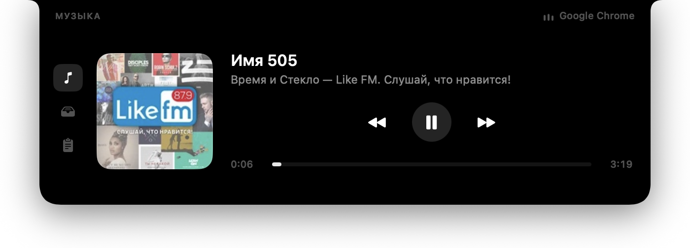

# Cyclop

Челка MacBook как рабочий инструмент. Нативное приложение на SwiftUI/AppKit: в покое
невидимо, по наведению мыши разворачивается вниз в панель с плеером, полкой для
файлов, историей буфера обмена и ближайшими встречами.



```
0.0 % CPU в покое  ·  41 МБ + 14 МБ helper  ·  1.2 МБ бандл  ·  без разрешений по умолчанию
```

Трек на снимке играет во вкладке браузера — Cyclop читает его из самой macOS, не
требуя ни разрешений, ни настроек в браузере. Как это устроено — ниже.

## Что умеет

| Вкладка | Что делает |
|---|---|
| **Музыка** | Обложка, трек, исполнитель, скраббер с перемоткой, prev / play-pause / next. Источник — **что угодно**: плеер, вкладка браузера, любое приложение, которое видит сама macOS |
| **Полка** | Перетащи файлы в челку — они лежат там, пока не понадобятся; тянешь карточку наружу и файл уходит куда нужно. Клик выбирает карточку, ⌘-клик — несколько, и тогда перетаскивается вся группа. Снимок экрана, сделанный в буфер обмена, сохраняется файлом и попадает сюда же. Картинка, присланная с телефона по AirDrop, тоже появляется здесь сама |
| **Буфер** | История последних 40 копирований, клик возвращает запись в буфер обмена |
| **Заготовки** | Ручной список того, что надоело набирать: почта, телефон, адрес. Читается из `~/Library/Application Support/Cyclop/snippets.json`, клик кладёт строку в буфер обмена |
| **Календарь** | Ближайшая встреча на неделю вперёд: сколько до неё осталось, кнопка подключения к Zoom, Meet, Teams и другим. Остальные встречи — списком |
| **Перевод** | Слева пишешь, справа появляется перевод — сам, офлайн, средствами macOS. Английский переводится на русский, русский на английский; направление берётся из письменности. Языковые пакеты macOS не предустанавливает, поэтому первый раз их надо скачать: Системные настройки → Основные → Язык и регион → «Языки перевода…» |

Панель раскрывается по наведению на челку и сворачивается, когда курсор ушел.
Вкладки тоже переключаются наведением — но только если курсор на иконке
задержался: проходящий мимо ничего не переключает.
Во время перетаскивания файлов она раскрывается сама и сразу показывает полку.
Иконка в меню-баре — переключить панель, включить автозапуск, выйти.

## Требования

- macOS 15 или новее (вкладка «Перевод» работает на Translation.framework)
- Swift 6 toolchain (полный Xcode не нужен, хватает Command Line Tools)

На маках без челки приложение тоже работает: панель считает челкой область
180×24 pt по центру верхней кромки экрана.

## Сборка

```bash
git clone https://github.com/akalikbergenov/cyclop.git
cd cyclop
./Scripts/bundle.sh          # swift build + сборка .app + ad-hoc подпись
open build/Cyclop.app
```

Иконка генерируется кодом, без графических редакторов:

```bash
swift Scripts/make-icon.swift "$PWD/Resources/AppIcon.icns"
```

## Разрешения

**Ни одного** — пока не откроешь календарь. Приложение не просит ни
Автоматизацию, ни Универсальный доступ, ни Запись экрана, и ничего не требует
настраивать в браузере. Позиция курсора читается через `NSEvent.mouseLocation`,
буфер — через публичный `NSPasteboard`, Now Playing — через helper (см. ниже).

Доступ к Календарю — единственное разрешение, которое Cyclop вообще запрашивает.
Оно нужно только вкладке «Календарь», и системный диалог показывается не при
запуске и не при открытии вкладки, а по явному нажатию кнопки на объясняющем
экране. Не пользуешься календарём — приложение так и остаётся без разрешений.

Второе — доступ к папке «Загрузки», за которой следит приём AirDrop. Его просит
сама macOS при первом чтении папки; выключить слежение можно в меню-баре, тогда
папка не открывается вовсе.

Разрешения понадобятся только запасному пути, если основной когда-нибудь
перестанет работать: тогда для Apple Music и Spotify будет запрошена
Автоматизация, а медиа-клавишам — Универсальный доступ.

## Как это устроено

**Окно.** Один `NSPanel` — borderless, non-activating, уровнем выше меню-бара,
`canJoinAllSpaces`. Он всегда одного размера (равен раскрытой панели) и никогда не
меняет frame: анимируется только содержимое. Так получается плавная анимация без
дерганья геометрии окна.

**Сквозные клики.** Рамка окна — 700 × 252 pt в центре верха экрана, и почти всё
это время она прозрачна. Возврат `nil` из `hitTest` тут не помогает: оконный
сервер уже выбрал наше окно получателем, а `nil` просто отбрасывает событие, не
передавая его ниже. Прозрачность на маршрутизацию тоже не влияет. Единственный
рабочий способ — `ignoresMouseEvents`, который переключается по позиции курсора:
внутри видимой панели окно кликабельно, снаружи полностью прозрачно для событий.

**Наведение.** Позиция курсора опрашивается по таймеру, а не приходит из мониторов
событий. Мониторы тут структурно ненадежны: глобальный не видит события,
доставленные окнам собственного приложения, а локальный работает только пока
приложение активно — чего с `.accessory` не случается никогда. Из-за этого реакция
зависела бы от того, какое окно оказалось под курсором. Чтение
`NSEvent.mouseLocation` от маршрутизации событий не зависит и ведет себя одинаково
везде.

**Курсор.** Форму курсора выбирает оконный сервер по курсорным регионам: берётся
самое верхнее окно, которое заявило регион под указателем. Не заявить ничего —
не значит «не трогать курсор», это значит выпасть из поиска, и тогда форму
задаёт окно снизу: над текстовым редактором панель получала I-beam. Обычные
cursor rects не подходят — AppKit выключает их для non-key окон. Поэтому
`NotchRootView` держит `NSTrackingArea` с `.cursorUpdate` и `.activeAlways`
ровно по своей кликабельной области.

**Наведение на вкладки.** Курсор ходит по панели транзитом, поэтому «навёл —
переключил» переключало бы вкладки при каждом пересечении рейки. Различие между
«хочу сюда» и «просто мимо» — во времени: проходящий курсор минует иконку за
десятки миллисекунд, выбирающий останавливается. Порог в 150 мс разводит эти два
случая, и ничего больше для этого не нужно. Увеличение иконки под курсором —
`scaleEffect`, а не изменение `frame`: раскладка, которая пересчитывается на
движение мыши, читается как подтормаживание.

Вкладка, которая печатает, забирает клавиатуру сразу — и по наведению тоже.
Панель, которая показывает поле ввода, но не принимает нажатий, хуже, чем на
секунду погасший курсор в чужом окне, а выдержка на рейке и так не пускает сюда
проходящий мимо курсор. Обратное всё же возможно: клик в другое приложение
снимает клавиатуру, не трогая вкладку, — набранный текст остаётся, панель
свободна свернуться. Вернуть клавиатуру можно кликом по полю, и ловится он в
`sendEvent` окна: жест на `TextEditor` не сработает, текстовый вид забирает
mouseDown раньше SwiftUI.

**AirDrop.** Скриншот с айфона попадает на полку сам, и без iCloud. Синхронизация
через Фото ждала бы облака, а iOS не отдаёт файлы стороннему приложению никаким
другим способом: Bluetooth-передачи там нет вовсе, и в Шорткатах нет триггера «сделан
снимок экрана», так что тапнуть «Поделиться» на телефоне придётся в любом случае.
Дальше всё происходит само: AirDrop между устройствами с одним Apple ID
принимается без подтверждения, и файл лежит в «Загрузках» примерно через секунду —
по прямому Wi-Fi, интернет не нужен.

Событие о приёме никто не рассылает — всё делает `sharingd`, — поэтому смотреть
приходится за папкой: дескриптор `O_EVTONLY` и `DispatchSource` на запись в каталог.
Одна пришедшая картинка даёт несколько срабатываний подряд (создан, записан,
переименован), поэтому очередь гасится на 0.4 с — к моменту чтения файл целый.

Отличить AirDrop от всего остального даёт карантинный штамп: macOS записывает в
него приложение, ответственное за появление файла, — Safari подписывает свои
загрузки «Safari», Telegram своим именем, а AirDrop — `sharingd`. Файл вообще без
штампа тоже берётся: так выглядит то, что сохранили в папку напрямую. Отвергнутое
пишется в лог с именем агента, чтобы правило можно было проверить, а не поверить в него.

**Приём с телефона.** AirDrop нельзя нацелить из быстрой команды: iOS отдаёт его
только через меню «Поделиться», а это тап и выбор устройства каждый раз. Зато
команда умеет отправить файл куда угодно сама, поэтому кратчайший путь от кнопки
«Действие» до полки — адрес, по которому можно положить. Один порт (17321), один
путь, никакой учётной записи и никакого облака между ними; интернет не нужен,
хватает общего Wi-Fi.

Адрес — `http://<имя-мака>.local:17321/drop/<секрет>`; имя резолвится по mDNS, так
что смена адреса роутером ничего не ломает. Секрет — шестнадцать случайных знаков,
сгенерированных однажды: порт отвечает всей локальной сети, и это то, что отделяет
телефон от остальных в кафе. Соразмерно тому, что за ним: записать картинку в одну
папку. Пункт «Скопировать адрес для телефона» в меню-баре кладёт готовую ссылку в
буфер — показывать её в самом меню значило бы дать прочесть через плечо.

Приёмник по умолчанию выключен: открытый сокет — не то, что заводят молча. Тип
файла определяется по содержимому, а не по заявленному отправителем: расширение
обязано совпадать с байтами, иначе QuickLook не нарисует превью карточки. Тело
принимается и сырым, и завёрнутым в multipart — в Шорткатах это одна настройка
рядом с другой, и обе разворачиваются здесь, а не превращаются в правило, которое
надо помнить.

**Заготовки.** История буфера — очередь по свежести, и вещь, нужная раз в
неделю, вымывается из неё именно потому, что редкая. Заготовки — обратная
дисциплина: короткий постоянный список, который никем и ничем не пополняется
сам. Он лежит в файле:

```json
[
  { "label": "Почта", "text": "имя@example.com" },
  { "text": "+7 700 000 00 00" }
]
```

`~/Library/Application Support/Cyclop/snippets.json`, `label` необязателен.
Приложение файл только читает — перечитывает при каждом заходе на вкладку, так
что менять его можно на ходу, не перезапуская. Пункт «Показать файл заготовок» в
меню-баре открывает его в Finder.

Клик по заготовке затирает буфер обмена — осознанно: затёртое остаётся в истории
«Буфера» на расстоянии одного клика, тогда как восстановление по таймеру было бы
гаданием о моменте вставки, а печать в чужое поле напрямую потребовала бы
Универсального доступа.

**Клавиатура.** Панель по умолчанию не может стать key: забрать фокус — значит
погасить заголовок чужого окна и остановить мигающий курсор в чужом тексте, а
для окна, на которое просто навели мышь, это слишком грубо. Вкладка «Перевод»
включает `canBecomeKey` на время своей работы; `.nonactivatingPanel` позволяет
принимать клавиатуру, не активируя приложение, так что редактор снизу остаётся
активным. Пока вкладка открыта, панель закреплена — курсор не может её закрыть
посреди слова, — а выход из неё происходит по Esc, по смене вкладки или по
клику в другом приложении, который панель ловит как потерю key-статуса.

**Перевод.** `Translation.framework`, полностью офлайн. Оба языка называются
явно: кириллица уходит в английский, всё остальное приходит в русский.
Направление определяется по письменности, а не определителем языка — одно слово
слишком коротко, чтобы опознать его надёжно, и «привет» регулярно определяется
как болгарский. Оставить исходный язык на усмотрение фреймворка тоже нельзя: его
определитель — отдельный ассет, который так же не установлен, поэтому
автоопределение падает с `unableToIdentifyLanguage`, а следующий за ним
`translate` не возвращается вовсе.

Языковые пакеты в macOS не предустановлены. Попросить их у системы умеет
`prepareTranslation()`, но он показывает собственное окно и блокируется, пока на
него не ответят, — а показать его над borderless-панелью приложения, которое
никогда не активно, негде. Поэтому пара сначала проверяется через
`LanguageAvailability`, и если пакета нет, панель говорит об этом и предлагает
кнопку в Системные настройки → Основные → Язык и регион → «Языки перевода…».

**Геометрия челки.** Ширина считается как `screen.frame.width` минус
`auxiliaryTopLeftArea` и `auxiliaryTopRightArea`, высота — из `safeAreaInsets.top`.
На тестовом MacBook Air M4 это 179 × 32 pt.

**Now Playing.** В macOS 15.4 демон `mediaremoted` начал отвечать только тем
клиентам, которым доверяет. Для обычного приложения это выглядит так (проверено
на 15.7.5 при играющей музыке):

| Вызов | Ответ |
|---|---|
| `MRMediaRemoteGetNowPlayingInfo` | 0 ключей |
| `MRMediaRemoteGetNowPlayingApplicationIsPlaying` | `false` |
| `MRMediaRemoteGetNowPlayingApplicationPID` | 0 |
| уведомления `kMRMediaRemote…DidChange`, 180 с со сменой трека | ни одного |

Объявить себе энтайтлмент `com.apple.mediaremote.external-access` тоже нельзя: он
попадает в подпись, но процесс убивается на старте (SIGKILL, exit 137).

Обход не требует ни отключения SIP, ни настроек в браузере. `/usr/bin/perl` —
платформенный бинарник Apple (`Platform identifier=16`), которому демон доверяет,
и подписан он без library validation, то есть может загрузить чужую библиотеку.
`Sources/CyclopMediaHelper/helper.m` компилируется в `libcyclopmedia.dylib`,
загружается в perl через `DynaLoader` и оттуда получает полный ответ демона:

```
$ perl -e 'use DynaLoader; DynaLoader::dl_load_file($ARGV[0], 0x01); sleep 4' libcyclopmedia.dylib
14 ключей: Title=Sen, Artist=Yerbol Narimanuly, Album=Sen,
           Duration=202.39, ElapsedTime=131.23, ArtworkData=<10681 байт JPEG>
```

Helper печатает по строке JSON на каждое изменение и принимает команды на stdin,
`NowPlayingFeed` читает его stdout. Так же идут play/pause, next/prev и перемотка
(`MRMediaRemoteSendCommand`, `MRMediaRemoteSetElapsedTime`). Helper завершается,
как только закрывается его stdin, поэтому пережить приложение не может.

Работает это для любого источника, который видит сама macOS: плеера, вкладки
браузера, чего угодно. Имя источника берется из pid владельца сессии.

**Запасной путь.** Если helper не сможет запуститься трижды подряд (perl убрали,
демон закрылся и для платформенных бинарников), `MediaController` переключается
на скриптование Apple Music и Spotify через AppleScript — тогда, и только тогда,
система спросит Автоматизацию.

**Цена простоя.** Частота опроса курсора адаптивная: 60 Гц, пока панель открыта
или курсор находится в полосе 260 pt вдоль верхней кромки экрана, и 8 Гц в
остальное время. Полосу нельзя миновать по пути к челке, поэтому полная частота
всегда уже включена к моменту, когда наведение начинает иметь значение. Постоянные
60 Гц стоили бы 0.7 % CPU, адаптивные — 0.0 %. Таймер позиции трека тикает только
во время воспроизведения, опрос буфера обмена — это чтение одного счетчика
`changeCount` дважды в секунду, а сами данные читаются только когда счетчик
сдвинулся.

## Ограничения

- Now Playing держится на приватном фреймворке и на том, что `/usr/bin/perl`
  остается платформенным бинарником без library validation. Apple может закрыть
  это в любом обновлении — тогда включится запасной путь с Music и Spotify. По
  той же причине приложение непригодно для App Store.
- Скриптовые рантаймы (включая perl) Apple объявила устаревшими и когда-нибудь
  уберет из системы. Helper переживет это ровно до того момента.
- Полка ссылается на файлы, а не копирует их: если переместить оригинал, карточка
  исчезнет при следующем запуске. Исключение — снимки экрана из буфера обмена:
  они сохраняются в `~/Pictures/Cyclop` и не удаляются автоматически никогда,
  даже когда карточка уходит с полки. Чистит папку только пользователь.
- Записи с типом `org.nspasteboard.ConcealedType` (менеджеры паролей) в историю
  буфера не попадают.
- Кнопка подключения появляется, только если ссылка на созвон есть в самом
  событии — в поле места, в заметках или в URL. Распознаются Meet, Zoom, Teams,
  Webex, Whereby, Jitsi, Телемост и Discord.
- Приём с телефона слушает обычный HTTP: адрес и картинка идут по локальной сети
  открыто. Дома за роутером этого достаточно, в открытом Wi-Fi — нет: тот, кто
  слушает сеть, увидит секрет и сможет класть картинки на твою полку. Приёмник
  выключен по умолчанию; в чужой сети его лучше не включать, а пользоваться
  AirDrop, которому сеть вообще не нужна.
- Языки перевода macOS не предустанавливает — первый раз пакет придётся скачать
  через Системные настройки; панель говорит об этом и открывает нужный экран.

## Структура

```
Sources/Cyclop
├── main.swift                 точка входа, .accessory
├── App/AppDelegate.swift      иконка в меню-баре, автозапуск
├── Notch/
│   ├── NotchGeometry.swift    размеры челки и производные прямоугольники
│   ├── NotchPanel.swift       NSPanel над меню-баром
│   ├── NotchRootView.swift    hit-test панели + приемник drag&drop
│   ├── PointerWatcher.swift   опрос курсора: наведение и сквозные клики
│   └── NotchController.swift  сборка окна, открытие/закрытие
├── Model/NotchViewModel.swift
├── Services/
│   ├── MediaController.swift  выбирает источник Now Playing
│   ├── NowPlayingFeed.swift   запуск helper в perl, разбор его stdout
│   ├── PlayerBridge.swift     запасной путь: AppleScript + медиа-клавиши
│   ├── ShelfStore.swift
│   ├── ClipboardStore.swift
│   ├── ScreenshotVault.swift  снимки из буфера на диск
│   ├── AirDropWatcher.swift   слежение за «Загрузками»: картинки с телефона
│   ├── DropInbox.swift        приём картинок по локальной сети от Шорткатов
│   ├── SnippetStore.swift     заготовки из snippets.json
│   ├── Translator.swift       Translation.framework, направление по письменности
│   └── CalendarStore.swift    EventKit: ближайшие встречи и ссылка на созвон
└── UI/                        NotchShape, панели вкладок, тема

Sources/CyclopMediaHelper
└── helper.m                   dylib для /usr/bin/perl: MediaRemote -> JSON
```

## Лицензия

MIT
